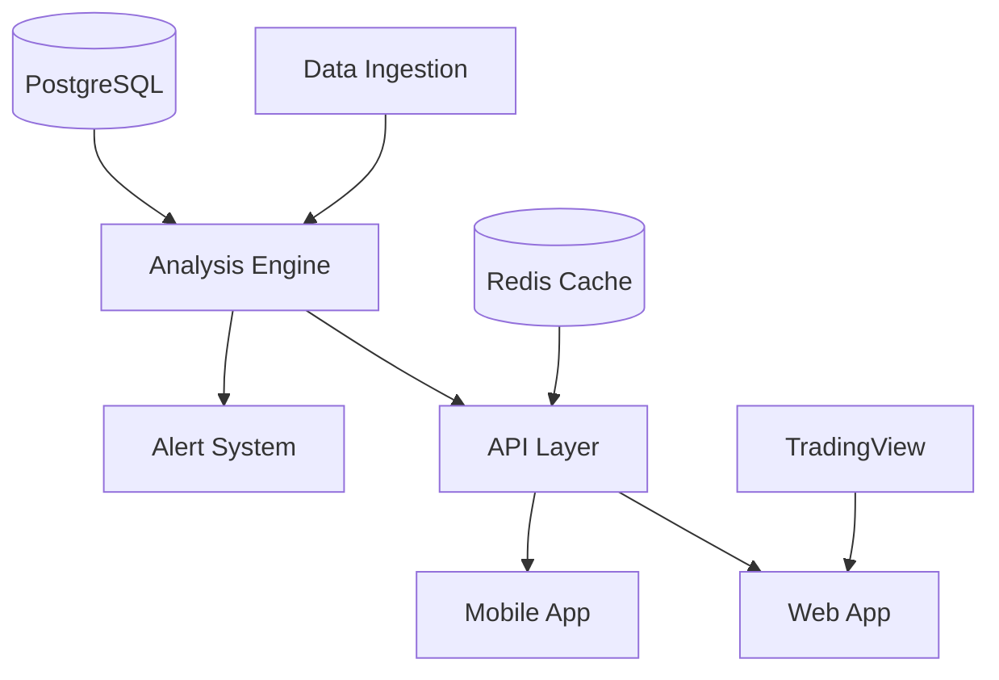

# Technical Architecture - Post-Earnings Drift Scanner

## System Overview



---

## 1. Data Pipeline Architecture

### Earnings Data Ingestion
```python
# earnings_ingestion_service.py
class EarningsIngestionService:
    """
    Polls multiple data sources for earnings releases
    Runs every 15 minutes during market hours
    """
    
    def __init__(self):
        self.sources = [
            FMPDataSource(),      # Primary: Financial Modeling Prep
            AlphaVantageSource(), # Backup
            YahooFinanceSource()  # Free fallback
        ]
        
    async def ingest_earnings_batch(self):
        """Process new earnings in real-time"""
        new_earnings = await self.fetch_latest_earnings()
        
        for earning in new_earnings:
            # Calculate surprise metrics
            surprise = self.calculate_surprise(earning)
            quintile = self.assign_quintile(surprise)
            
            # Store in database
            await self.store_earning(earning, surprise, quintile)
            
            # Trigger analysis if Q1 or Q5
            if quintile in [1, 5]:
                await self.queue_for_analysis(earning)
```

### Historical Pattern Analysis
```python
# drift_analyzer.py
class DriftAnalyzer:
    """
    Analyzes historical drift patterns by surprise quintile
    Pre-calculates optimal entry/exit points
    """
    
    def analyze_symbol_patterns(self, symbol: str) -> DriftPattern:
        """Generate drift statistics for a symbol"""
        
        # Pull last 12 quarters of earnings
        historical = self.get_historical_earnings(symbol, quarters=12)
        
        # Calculate drift paths for each quintile
        patterns = {
            'Q5': self.calculate_quintile_drift(historical, quintile=5),
            'Q4': self.calculate_quintile_drift(historical, quintile=4),
            'Q3': self.calculate_quintile_drift(historical, quintile=3),
            'Q2': self.calculate_quintile_drift(historical, quintile=2),
            'Q1': self.calculate_quintile_drift(historical, quintile=1)
        }
        
        # Find optimal holding periods
        optimal_days = self.find_optimal_exit(patterns)
        
        return DriftPattern(
            symbol=symbol,
            patterns=patterns,
            optimal_hold=optimal_days,
            confidence=self.calculate_confidence(patterns)
        )
```

---

## 2. Backend API Design

### FastAPI Structure
```
earnings_drift_scanner/
├── api/
│   ├── main.py                 # FastAPI app
│   ├── routers/
│   │   ├── screener.py         # Screening endpoints
│   │   ├── analysis.py         # Detailed analysis
│   │   ├── playbooks.py        # Playbook generation
│   │   ├── portfolio.py        # Portfolio tracking
│   │   └── research.py         # Historical data
│   ├── services/
│   │   ├── drift_analyzer.py   # Core analysis logic
│   │   ├── playbook_generator.py
│   │   ├── position_tracker.py
│   │   └── alert_service.py
│   ├── models/
│   │   ├── earnings.py         # SQLAlchemy models
│   │   ├── patterns.py
│   │   └── positions.py
│   └── utils/
│       ├── quintile_calc.py
│       ├── statistics.py
│       └── risk_sizing.py
```

### Key API Endpoints
```python
# Screener Endpoint
@router.get("/api/opportunities")
async def get_opportunities(
    quintiles: List[int] = Query([1, 5]),
    days_since: int = Query(2),
    min_market_cap: float = Query(1e9),
    sector: Optional[str] = None
) -> List[Opportunity]:
    """Returns current drift opportunities"""
    
# Analysis Endpoint  
@router.get("/api/analysis/{symbol}")
async def get_drift_analysis(
    symbol: str,
    include_historical: bool = True
) -> DriftAnalysis:
    """Deep analysis for a specific symbol"""
    
# Playbook Generator
@router.post("/api/playbook")
async def generate_playbook(
    symbol: str,
    account_size: float,
    risk_tolerance: RiskLevel
) -> List[TradingPlay]:
    """Generate specific trading recommendations"""
```

### Real-time Drift Tracking
```python
# position_tracker.py
class PositionTracker:
    """
    Tracks active positions and compares to expected drift
    Updates every 5 minutes during market hours
    """
    
    async def track_positions(self):
        active_positions = await self.get_active_positions()
        
        for position in active_positions:
            # Get current price
            current_price = await self.get_quote(position.symbol)
            
            # Calculate actual drift
            actual_drift = (current_price - position.entry) / position.entry
            
            # Compare to expected drift curve
            expected = self.get_expected_drift(
                position.symbol, 
                position.days_held,
                position.quintile
            )
            
            # Alert if significantly off track
            if abs(actual_drift - expected) > 0.02:
                await self.send_deviation_alert(position, actual_drift, expected)
```

---

## 3. Database Schema

### PostgreSQL Tables
```sql
-- Earnings events table
CREATE TABLE earnings_events (
    id SERIAL PRIMARY KEY,
    symbol VARCHAR(10) NOT NULL,
    earnings_date DATE NOT NULL,
    eps_actual DECIMAL(10,4),
    eps_estimated DECIMAL(10,4),
    surprise_percent DECIMAL(10,2),
    quintile INTEGER CHECK (quintile BETWEEN 1 AND 5),
    created_at TIMESTAMP DEFAULT NOW(),
    UNIQUE(symbol, earnings_date)
);

-- Historical drift patterns
CREATE TABLE drift_patterns (
    id SERIAL PRIMARY KEY,
    symbol VARCHAR(10) NOT NULL,
    quintile INTEGER NOT NULL,
    days_after INTEGER NOT NULL,
    avg_drift DECIMAL(10,4),
    std_dev DECIMAL(10,4),
    win_rate DECIMAL(5,2),
    sample_size INTEGER,
    last_updated TIMESTAMP DEFAULT NOW(),
    INDEX idx_symbol_quintile (symbol, quintile)
);

-- User positions tracking
CREATE TABLE positions (
    id SERIAL PRIMARY KEY,
    user_id INTEGER REFERENCES users(id),
    symbol VARCHAR(10) NOT NULL,
    entry_date DATE NOT NULL,
    entry_price DECIMAL(10,2),
    position_size INTEGER,
    quintile INTEGER,
    expected_drift DECIMAL(10,4),
    actual_drift DECIMAL(10,4),
    status VARCHAR(20) DEFAULT 'active',
    exit_date DATE,
    exit_price DECIMAL(10,2),
    created_at TIMESTAMP DEFAULT NOW()
);
```

### Redis Caching Strategy
```python
# Cache keys structure
CACHE_KEYS = {
    "opportunities": "drift:opportunities:{quintile}:{sector}",
    "analysis": "drift:analysis:{symbol}",
    "patterns": "drift:patterns:{symbol}:{quintile}",
    "quotes": "quotes:{symbol}",
    "user_positions": "positions:user:{user_id}"
}

# Cache durations
CACHE_TTL = {
    "opportunities": 300,    # 5 minutes
    "analysis": 3600,        # 1 hour
    "patterns": 86400,       # 24 hours
    "quotes": 5,             # 5 seconds
    "user_positions": 60     # 1 minute
}
```

---

## 4. Frontend Architecture

### Next.js 14 App Structure
```
app/
├── (auth)/
│   ├── login/
│   └── register/
├── (dashboard)/
│   ├── page.tsx              # Main dashboard
│   ├── screener/
│   ├── analysis/[symbol]/
│   ├── portfolio/
│   └── research/
├── api/                      # Next.js API routes
├── components/
│   ├── charts/
│   │   ├── DriftChart.tsx    # TradingView wrapper
│   │   ├── PathsOverlay.tsx
│   │   └── VolumeAnalysis.tsx
│   ├── playbooks/
│   │   ├── PlaybookCard.tsx
│   │   └── PositionSizer.tsx
│   └── tables/
│       ├── OpportunityTable.tsx
│       └── PositionTracker.tsx
└── lib/
    ├── api-client.ts
    ├── websocket.ts
    └── calculations.ts
```

### Real-time Updates via WebSocket
```typescript
// lib/websocket.ts
export class DriftWebSocket {
  private ws: WebSocket;
  
  connect() {
    this.ws = new WebSocket('wss://api.driftedge.com/ws');
    
    this.ws.on('message', (data) => {
      const update = JSON.parse(data);
      
      switch(update.type) {
        case 'NEW_OPPORTUNITY':
          this.handleNewOpportunity(update);
          break;
        case 'DRIFT_UPDATE':
          this.updatePositionDrift(update);
          break;
        case 'ALERT':
          this.showAlert(update);
          break;
      }
    });
  }
}
```

---

## 5. Infrastructure & DevOps

### Deployment Architecture
```yaml
# docker-compose.yml
version: '3.8'

services:
  api:
    build: ./backend
    ports:
      - "8000:8000"
    environment:
      - DATABASE_URL=postgresql://user:pass@db:5432/driftedge
      - REDIS_URL=redis://redis:6379
    depends_on:
      - db
      - redis
      
  web:
    build: ./frontend
    ports:
      - "3000:3000"
    environment:
      - NEXT_PUBLIC_API_URL=https://api.driftedge.com
      
  db:
    image: postgres:15
    volumes:
      - postgres_data:/var/lib/postgresql/data
      
  redis:
    image: redis:7-alpine
    
  nginx:
    image: nginx:alpine
    ports:
      - "443:443"
    volumes:
      - ./nginx.conf:/etc/nginx/nginx.conf
      - ./ssl:/etc/nginx/ssl
```

### Monitoring & Alerts
```python
# monitoring/health_checks.py
class SystemMonitor:
    """
    Monitors system health and data quality
    """
    
    async def run_health_checks(self):
        checks = [
            self.check_data_freshness(),
            self.check_api_latency(),
            self.check_calculation_accuracy(),
            self.check_position_tracking()
        ]
        
        results = await asyncio.gather(*checks)
        
        if any(not r.healthy for r in results):
            await self.send_ops_alert(results)
```

---

## 6. Security & Compliance

### API Security
- JWT authentication with refresh tokens
- Rate limiting: 100 req/min for Pro, 20 req/min for Starter
- All endpoints require authentication except public screener
- Audit logging for all trades and recommendations

### Data Privacy
- No storage of brokerage credentials
- Position data encrypted at rest
- GDPR-compliant data deletion
- SOC 2 Type I compliance roadmap

### Financial Disclaimers
- Clear risk warnings on every playbook
- "Not financial advice" disclaimers
- Historical performance disclosures
- No guarantee of future results

---

## Performance Targets

- Page load: <100ms (cached), <500ms (fresh)
- API response: <50ms for screener, <200ms for analysis
- Data freshness: <15 minutes for earnings, <5 seconds for quotes
- Uptime: 99.9% excluding scheduled maintenance
- Concurrent users: 10,000+ without degradation